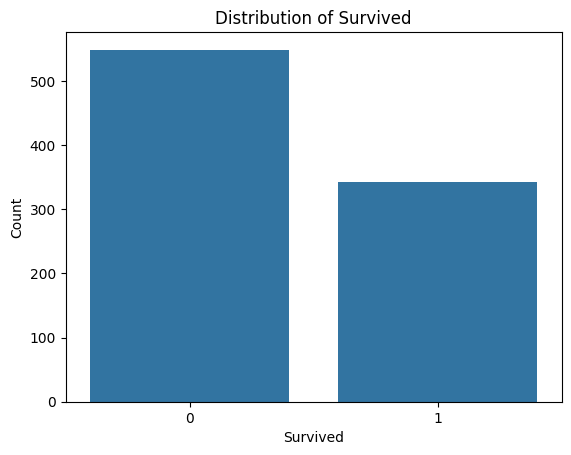
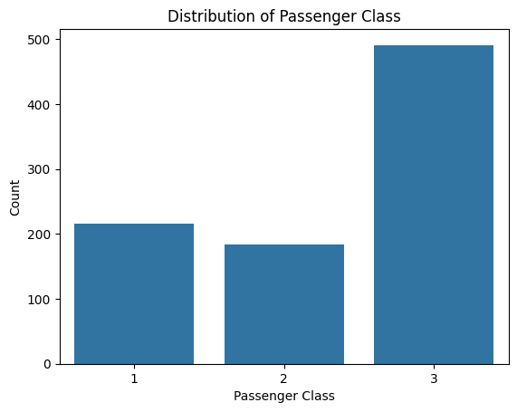
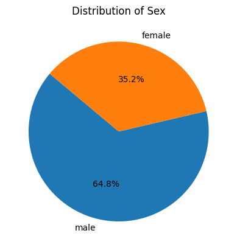
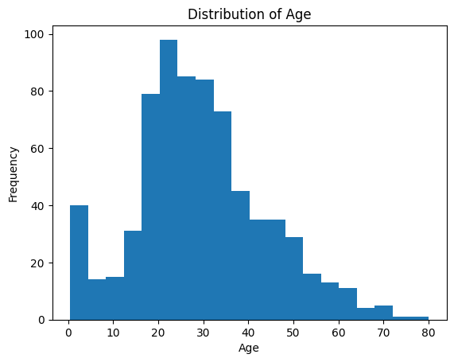
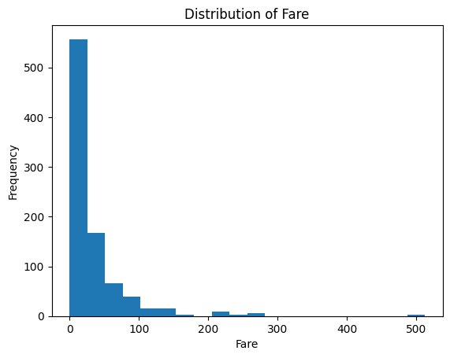
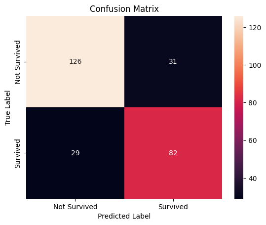

# 🚢 Titanic Survival Prediction using Naive Bayes

## 📌 Overview
This project focuses on predicting whether a passenger survived the Titanic disaster using a **Gaussian Naive Bayes classification model**.

The project includes:
- Data cleaning and preprocessing
- Exploratory Data Analysis (EDA)
- Feature engineering
- Model training and evaluation

---

## 📊 Dataset Information

The dataset used in this project is **Titanic Dataset (`titanic.csv`)**, which contains passenger details.

### 🔹 Features:
- `passenger_id` – Unique ID
- `name` – Passenger name
- `p_class` – Ticket class (1, 2, 3)
- `sex` – Gender
- `age` – Age of passenger
- `sib_sp` – Siblings/Spouses aboard
- `parch` – Parents/Children aboard
- `ticket` – Ticket number
- `fare` – Ticket fare
- `cabin` – Cabin number
- `embarked` – Boarding port
- `survived` – Target variable (0 = No, 1 = Yes)

---

## 🎯 Objective
To build a machine learning model that predicts whether a passenger survived based on selected features.

---

## 🔍 Exploratory Data Analysis (EDA)

### 🔹 Survival Distribution

👉 **Insight:**
- Shows how many passengers survived vs not survived
- Helps identify class imbalance

---

### 🔹 Passenger Class Distribution

👉 **Insight:**
- Displays distribution of passengers across classes
- Useful to understand socio-economic impact on survival

---

### 🔹 Gender Distribution (Pie Chart)

👉 **Insight:**
- Shows percentage of male vs female passengers
- Important because survival rate depends on gender

---

### 🔹 Age Distribution (Histogram)

👉 **Insight:**
- Shows distribution of passenger ages
- Helps understand age groups present in dataset

---

### 🔹 Fare Distribution (Histogram)

👉 **Insight:**
- Displays how ticket fares are distributed
- Helps understand economic variation among passengers

---

## ⚙️ Data Preprocessing

- Dropped unnecessary columns:
- passenger_id, name, sib_sp, parch, ticket, cabin, embarked
  - Filled missing values:
- `age` → median
- `fare` → median
- Encoded categorical variable:
- `sex` → One-Hot Encoding
- Feature scaling:
- Standardized `fare` using StandardScaler

---

## 🤖 Model Used

### 🔹 Gaussian Naive Bayes

👉 **Why this model?**
- Works well for classification problems
- Fast and efficient
- Performs well with smaller datasets
- Based on probability theory

---

## 📈 Model Training

- Selected Features:
- p_class, sex_male, age, fare
-  Target:
-  survived
  
  ## 📊 Results & Evaluation

---
### 🔹 Classification Report

| Class | Precision | Recall | F1-Score | Support |
|------|----------|--------|----------|--------|
| 0 (Not Survived) | 0.80 | 0.84 | 0.82 | 157 |
| 1 (Survived)     | 0.76 | 0.71 | 0.73 | 111 |

### 🔹 Overall Metrics
- **Accuracy:** 0.79  
- **Macro Avg:** Precision: 0.78 | Recall: 0.78 | F1: 0.78  
- **Weighted Avg:** Precision: 0.79 | Recall: 0.79 | F1: 0.79

### 🔹 Correlation Heatmap
  

### 🔹 Insights
- Model performs better for **class 0 (non-survivors)**
- Slight imbalance in recall for class 1 indicates some missed survival predictions

## 📌 Future Improvements

- Improve model performance using advanced algorithms (Logistic Regression, SVM, Random Forest)  
- Perform hyperparameter tuning  
- Apply cross-validation for better generalization  
- Handle feature engineering more effectively  
- Try feature scaling on additional variables  
- Deploy the model using a web framework (Flask/Streamlit)

## 🛠️ Tools & Technologies

- **Programming Language:** Python  
- **Libraries Used:**
  - Pandas → Data manipulation  
  - NumPy → Numerical operations  
  - Matplotlib & Seaborn → Data visualization  
  - Scikit-learn → Model building & evaluation  
- **Model:** Gaussian Naive Bayes    
